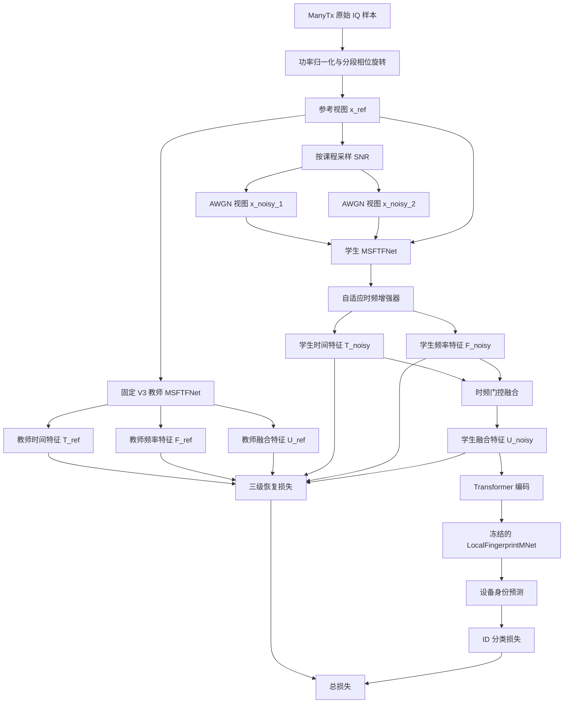

# RobustSEI_CleanAnchorV4_MultiLevelRestore 完整方案说明

> 方案名称：RobustSEI_CleanAnchorV4_MultiLevelRestore
>
> 简称：V4 Multi-Level Restore
>
> 对应代码提交：`1d55809`
>
> 正式训练入口：`train_multilevel_restore.py`
>
> 特征提取器：`MSFTFNet`
>
> 数据集：ManyTx
>
> 预训练类别数：90
>
> 核心目标：在不破坏正常信号识别性能的前提下，提高特定辐射源识别模型在 `0 dB`、`-5 dB` 和 `-10 dB` 下的鲁棒性。

---

## 1. 方案解决什么问题

特定辐射源识别（Specific Emitter Identification，SEI）利用发射机硬件非理想性产生的细微差异识别设备身份。这些指纹通常比调制内容和信号主体弱得多，容易被接收噪声掩盖。

现有 MSFTFNet 在正常条件下已经具有较高准确率，但随着信噪比降低，性能快速下降。此前实验表明：

| 方法 | 干净 Acc | -10 dB Acc | -5 dB Acc | 0 dB Acc |
|---|---:|---:|---:|---:|
| 原始 MSFTFNet + RobustSEI | 90.97% | 9.98% | 42.63% | 79.23% |
| CleanAnchorV3（已有结果） | 91.59% | 9.82% | 49.80% | 84.65% |
| FixedRestoreFT（已有结果） | 91.72% | 10.37% | 50.75% | 85.36% |

说明：表中干净条件和部分中高 SNR 数值来自对应最佳权重的代表性单次评估，`-10/-5 dB` 核心结果采用已有五次重复均值。正式论文表格必须重新使用统一的重复次数和统计口径。

CleanAnchorV3 和 FixedRestoreFT 已经明显改善 `-5 dB` 和 `0 dB`，但 `-10 dB` 仍然接近性能瓶颈。

此前方案主要在最终身份特征处进行一致性约束。问题是：如果低 SNR 输入在时间分支、频率分支和融合阶段已经丢失了身份信息，只在最后一层对齐特征可能太晚。

因此，V4 的核心问题定义为：

> 如何利用固定的高质量教师，在时间分支、频率分支和时频融合三个层级上同时约束低 SNR 学生特征，并通过轻量自适应增强模块恢复被噪声削弱的局部指纹。

---

## 2. 核心思想

V4 包含两个紧密关联的核心设计。

### 2.1 信号条件自适应时频增强

在 MSFTFNet 的时间分支和频率分支之后、时频融合之前加入轻量残差增强器。

增强器不直接接收人工提供的 SNR 数值。它根据当前时间特征和频率特征的统计量，自适应估计两个分支的可靠性，并生成对应的残差修正。

这样做有两个优点：

1. 训练和测试时不需要提前知道真实 SNR；
2. 不同样本可以得到不同的时间/频率增强强度。

代码类：

```text
models/MSFTFNetFeature.py
└── AdaptiveTFEnhancer
```

### 2.2 固定教师多层恢复监督

使用已训练完成的 `RobustSEI_CleanAnchorV3` 作为固定教师。

教师处理原始参考视图，学生处理由同一个参考视图生成的低 SNR AWGN 视图。学生在三个层级上向教师靠近：

1. 时间分支特征 `time_map`；
2. 频率分支特征 `freq_map`；
3. 时频融合特征 `fused_map`。

这比只对齐最终身份向量提供了更直接的恢复信号。

---

## 3. “干净参考”准确含义

方案中的 `clean` 或“干净参考”并不表示实验获得了物理意义上完全无噪声的理想信号。

它表示：

> 数据集提供的原始样本，不再额外叠加当前训练阶段生成的 AWGN。

因此，更严谨的论文表述应使用：

- original reference view；
- uncorrupted reference view；
- reference observation；
- clean-anchor view（并在文中给出定义）。

不应直接声称教师输入是绝对无噪声信号。

此外，预训练数据加载器会生成 8 个分段相位旋转视图。当前 V4 使用：

```python
mixed_inputs = signals[:, 0]
```

所以参考视图实际是第一个分段相位旋转视图。教师和学生由同一个参考视图构造，因此配对关系仍然成立。

---

## 4. 数据和预处理

### 4.1 数据文件

ManyTx 默认服务器路径：

```text
~/Datasets/ManyTx
```

预训练使用：

```text
X_train_90Class.npy
Y_train_90Class.npy
```

评估使用：

```text
X_test_90Class.npy
Y_test_90Class.npy
```

### 4.2 数据形状

单个 IQ 样本期望形状为：

```text
[2, signal_length]
```

其中：

- 第 1 个通道为 I；
- 第 2 个通道为 Q；
- 数据加载器使用前 4800 个采样点。

训练批次经过相位旋转增强后形状为：

```text
[batch_size, rot_num, 2, 4800]
```

默认：

```text
batch_size = 128
rot_num = 8
```

V4 身份与恢复训练使用第一个旋转视图：

```text
[batch_size, 2, 4800]
```

### 4.3 功率归一化

每个样本按照最大瞬时 IQ 功率进行归一化：

```text
p_max = max_t(I_t^2 + Q_t^2)
x_norm = x / sqrt(p_max)
```

对应配置：

```text
normalize = power
```

### 4.4 训练/验证划分

训练文件内部按照 `80%/20%` 划分：

- 80%：训练集；
- 20%：验证集。

划分特点：

- 按设备标签分层；
- 随机种子为 `2024`；
- 保证各设备在训练集和验证集中的比例基本一致。

---

## 5. 整体流程



---

## 6. MSFTFNet 特征提取过程

### 6.1 时间分支

时间分支直接处理 IQ 序列：

```text
IQ 输入
→ Conv1d(kernel=16, stride=8)
→ 多尺度时间块
→ 多尺度时间块
→ AdaptiveAvgPool1d(31)
```

每个多尺度时间块包含四条卷积分支：

| 分支 | 卷积设置 |
|---|---|
| 1 | kernel=3 |
| 2 | kernel=5 |
| 3 | kernel=9 |
| 4 | kernel=3, dilation=2 |

四条分支拼接后通过 `1×1` 卷积融合，并与输入残差相加。

输出：

```text
time_map ∈ R^(B×128×31)
```

### 6.2 频率分支

首先把 I/Q 构造成复数信号：

```text
x_complex = I + jQ
```

然后计算正交归一化 FFT，并保留正频率部分：

```text
X = FFT(x_complex)
```

频率输入包含两个通道：

```text
log(1 + |X|)
cos(angle(X))
```

后续结构：

```text
频率双通道
→ Conv1d(kernel=5)
→ 多尺度时间块
→ AdaptiveAvgPool1d(31)
```

输出：

```text
freq_map ∈ R^(B×128×31)
```

### 6.3 自适应时频增强

对时间和频率特征分别计算：

```text
mean(feature_map)
std(feature_map)
```

时间统计量和频率统计量拼接后维度为：

```text
4C = 4 × 128
```

可靠性门控网络：

```text
Linear(4C → C)
→ GELU
→ Linear(C → 2)
→ Sigmoid
```

得到两个样本级可靠性系数：

```text
g_t ∈ [0, 1]
g_f ∈ [0, 1]
```

时间残差和频率残差结构相同：

```text
GroupNorm
→ depthwise Conv1d(kernel=5)
→ GELU
→ Conv1d(C → C/2, kernel=1)
→ GELU
→ Conv1d(C/2 → C, kernel=1)
```

增强公式：

```text
T_enh = T + g_t · R_t(T)
F_enh = F + g_f · R_f(F)
```

最后一层 `1×1` 投影使用零初始化，因此训练开始时：

```text
R_t(T) = 0
R_f(F) = 0
T_enh = T
F_enh = F
```

这保证了新增模块在初始状态下不会破坏 V3 表示。

### 6.4 时频融合

融合模块根据时间和频率特征的全局均值计算两个 softmax 权重：

```text
[w_t, w_f] = Softmax(MLP([mean(T_enh), mean(F_enh)]))
```

融合结果：

```text
U = w_t · T_enh + w_f · F_enh
```

其中：

```text
w_t + w_f = 1
```

### 6.5 Transformer 编码

融合特征转置为 token 序列并加入位置嵌入：

```text
[B, 128, 31] → [B, 31, 128]
```

Transformer 参数：

| 参数 | 数值 |
|---|---:|
| token 数 | 31 |
| embedding dim | 128 |
| 层数 | 3 |
| 注意力头数 | 4 |
| FFN dim | 512 |
| dropout | 0.3 |
| activation | GELU |

最终输出经过 LayerNorm 并恢复为：

```text
feature_map ∈ R^(B×128×31)
```

---

## 7. 教师和学生

### 7.1 教师来源

教师权重来自：

```text
runs/Pretext_RobustSEI_CleanAnchorV3_random_rot/
└── MSFTFNet_manytx_iq_powerNorm_RobustSEI_CleanAnchorV3/
    ├── best_encoder.pth
    └── best_lfdb.pth
```

默认使用：

```text
teacher_checkpoint = best
```

### 7.2 旧权重兼容

V3 权重中没有 `tf_enhancer`。

加载旧 MSFTFNet 权重时，代码只允许缺失：

```text
tf_enhancer.*
```

其他缺失或多余参数仍会触发错误，避免静默加载不兼容模型。

缺失的增强器使用零初始化残差，因此教师初始行为与原 V3 一致。

### 7.3 教师状态

教师：

- 始终处于 `eval()`；
- 所有参数 `requires_grad=False`；
- 不执行 EMA 更新；
- 不参与反向传播；
- 只产生参考时间、频率和融合特征。

### 7.4 学生初始化

学生首先加载同一份 V3 编码器和 LFDB 权重。

因此 V4 不是从随机模型重新训练，而是在 V3 的身份识别能力上学习低 SNR 增强。

---

## 8. AWGN 配对视图

V4 使用专门的：

```text
random_awgn_level_view
```

它对同一个参考 IQ 样本独立生成两个 AWGN 视图。

噪声功率按每个样本独立计算：

```text
P_signal = mean(x^2)
P_noise = P_signal / 10^(SNR/10)
x_noisy = x + Normal(0, P_noise)
```

V4 的配对视图不加入：

- Rayleigh 衰落；
- Rician 衰落；
- 多径延迟；
- 额外随机相位和幅度扰动。

原因是多层特征恢复要求教师和学生在时间位置上保持对应。如果加入多径时移，逐位置特征目标会变得不一致。

这也使训练噪声生成方式与 `evaluate_snr.py` 的 AWGN 测试更加一致。

---

## 9. 低 SNR 课程训练

### 9.1 第一阶段：建立中低噪声恢复能力

```text
Epoch 1–10
```

采样概率：

| SNR | 概率 |
|---:|---:|
| 0 dB | 50% |
| -5 dB | 50% |

目标：

- 保持 V3 身份判别边界；
- 学习基础 AWGN 特征恢复；
- 避免训练开始即被 `-10 dB` 强噪声主导。

### 9.2 第二阶段：逐步加入极低 SNR

```text
Epoch 11–30
```

采样概率：

| SNR | 概率 |
|---:|---:|
| -5 dB | 70% |
| -10 dB | 30% |

目标：

- 保持已建立的 `-5 dB` 恢复能力；
- 逐步学习 `-10 dB`；
- 减少课程切换造成的训练震荡。

### 9.3 第三阶段：以极低 SNR 为主

```text
Epoch 31–60
```

采样概率：

| SNR | 概率 |
|---:|---:|
| -10 dB | 60% |
| -5 dB | 30% |
| 0 dB | 10% |

目标：

- 集中优化 `-10 dB`；
- 保留一定 `-5 dB` 和 `0 dB` 样本；
- 降低灾难性遗忘和正常性能下降风险。

### 9.4 固定验证分布

所有 epoch 的验证集都从以下集合等概率采样：

```text
{-10 dB, -5 dB, 0 dB}
```

因此，最佳模型的选择标准在整个训练过程中保持一致，不会随着课程阶段变化。

---

## 10. 损失函数

V4 只使用两项损失：

```text
ID + MULTI_RESTORE
```

不使用：

- MASK loss；
- adversarial loss；
- orthogonal loss；
- disentanglement loss；
- channel classification loss；
- AutomaticWeightedLoss。

### 10.1 身份分类损失

学生分别处理：

- 参考视图；
- AWGN 视图 1；
- AWGN 视图 2。

定义：

```text
L_clean_ID = CE(p_clean, y)
```

```text
L_noisy_ID = CE([p_noisy_1; p_noisy_2], [y; y])
```

身份损失：

```text
L_ID =
    λ_clean · L_clean_ID
  + λ_noisy · L_noisy_ID
```

当前参数：

```text
λ_clean = 1.0
λ_noisy = 1.0
```

### 10.2 归一化特征图距离

对特征图按通道维归一化：

```text
H_hat = H / ||H||_2
```

单层距离：

```text
D(H_student, H_teacher)
= mean(1 - sum_c(H_student_hat · H_teacher_hat))
```

该距离强调特征方向一致性，减少绝对幅值变化对监督的影响。

### 10.3 多层恢复损失

对单个噪声视图：

```text
L_view =
  1/3 · [
      D(T_noisy, T_ref)
    + D(F_noisy, F_ref)
    + D(U_noisy, U_ref)
  ]
```

两个独立噪声视图取平均：

```text
L_multi =
  1/2 · [L_view_1 + L_view_2]
```

加权恢复损失：

```text
L_MULTI_RESTORE = λ_restore · L_multi
```

当前：

```text
λ_restore = 0.2
```

### 10.4 总损失

```text
L_total = L_ID + L_MULTI_RESTORE
```

代码使用直接求和，不通过自动多任务权重模块重新缩放。

---

## 11. 参数冻结和优化

### 11.1 完全冻结

以下部分不更新：

- 固定 V3 教师全部参数；
- 学生时间 stem；
- 学生频率 stem；
- 学生前两个 Transformer 层；
- 学生位置嵌入；
- 学生原始分类 head；
- LocalFingerprintMNet 全部参数；
- LFDB mask 与身份分类头。

### 11.2 主要训练参数

自适应时频增强器：

```text
tf_enhancer
```

学习率：

```text
1e-4
```

### 11.3 小学习率适配参数

选择性解冻：

- 时频融合门控；
- 最后一个 Transformer 层；
- 输出 LayerNorm。

学习率：

```text
1e-5
```

### 11.4 优化器

```text
AdamW
```

参数：

| 参数 | 数值 |
|---|---:|
| enhancer lr | 1e-4 |
| encoder adapter lr | 1e-5 |
| weight decay | 1e-4 |
| grad clip | 5.0 |
| scheduler | StepLR |
| step size | 40 |
| gamma | 0.1 |

训练日志应显示：

```text
lr = 0.0001, 1e-05
```

---

## 12. 正式配置

训练入口中的关键配置：

```python
pretrain_config(
    encoder_name="MSFTFNet",
    dataset_name="manytx",
    feature_dim=1024,
    max_epoch=60,
    batch_size=128,
    lr=1e-4,
    weight_decay=1e-4,
    lr_step=40,
    method_name="RobustSEI_CleanAnchorV4_MultiLevelRestore",
    clean_id_weight=1.0,
    noisy_id_weight=1.0,
    multilevel_restore_weight=0.2,
    low_snr_start_epoch=10,
    very_low_snr_start_epoch=30,
    teacher_checkpoint="best",
    restoration_only=True,
    selective_encoder_finetune=True,
    encoder_adapt_lr=1e-5,
    grad_clip=5.0,
)
```

TSLA/MSFTF 参数：

```text
seq_len = 256
patch_size = 16
num_channels = 2
emb_dim = 128
depth = 3
dropout_rate = 0.3
```

说明：输入实际使用前 4800 个采样点。`seq_len=256` 和 `patch_size=16` 用于确定目标 token 数，MSFTFNet 通过自适应池化把分支输出统一为 31 个 token，因此不会出现旧 CVTSLANet 的 599/31 位置嵌入尺寸冲突。

---

## 13. 训练步骤

### 13.1 更新代码

```bash
cd ~/yl/NP3MC/NEW3
git pull
conda activate p3mc
git log -1 --oneline
```

应包含：

```text
1d55809 Add multi-level low-SNR restoration training
```

### 13.2 五轮冒烟测试

```bash
rm -f train_multilevel_restore_test.log

nohup python train_multilevel_restore.py \
  --epoch 5 \
  > train_multilevel_restore_test.log 2>&1 &

tail -f train_multilevel_restore_test.log
```

检查：

```bash
grep -E "Val Set|Best Record|End" \
  train_multilevel_restore_test.log
```

### 13.3 正式 60 轮训练

```bash
rm -f train_multilevel_restore_full.log

nohup python train_multilevel_restore.py \
  --epoch 60 \
  > train_multilevel_restore_full.log 2>&1 &

tail -f train_multilevel_restore_full.log
```

根据服务器测试速度，预计约：

```text
1 小时至 1 小时 10 分钟
```

### 13.4 查看关键日志

```bash
grep -E "Epoch|Val Set|Best Record|End" \
  train_multilevel_restore_full.log
```

查看进程：

```bash
ps -ef | grep "[t]rain_multilevel_restore.py"
```

查看 GPU：

```bash
nvidia-smi
```

---

## 14. 权重和日志保存

输出根目录：

```text
runs/Pretext_RobustSEI_CleanAnchorV4_MultiLevelRestore_random_rot/
└── MSFTFNet_manytx_iq_powerNorm_RobustSEI_CleanAnchorV4_MultiLevelRestore/
```

主要文件：

```text
best_encoder.pth
best_lfdb.pth
best_id_classifier.pth
final_encoder.pth
final_lfdb.pth
final_id_classifier.pth
checkpoint.pth
```

每次训练还会生成时间戳子目录。

最佳模型选择依据：

1. 优先选择验证 `SEI-Acc` 最高的 epoch；
2. 如果准确率相同，选择损失更低的 epoch。

---

## 15. 评估步骤

### 15.1 正常测试集

```bash
python evaluate_robust_sei.py \
  -e MSFTFNet -d manytx \
  --method_name RobustSEI_CleanAnchorV4_MultiLevelRestore \
  --checkpoint best
```

输出：

- Accuracy；
- Macro-F1。

### 15.2 分 SNR 测试

```bash
python evaluate_snr.py \
  -e MSFTFNet -d manytx \
  --method_name RobustSEI_CleanAnchorV4_MultiLevelRestore \
  --checkpoint best
```

测试：

```text
-10, -5, 0, 5, 10, 15, 20 dB
```

### 15.3 五次重复

评估噪声每次随机生成，因此正式结果应至少重复 5 次：

```bash
for i in 1 2 3 4 5
do
  echo "===== Repeat $i ====="
  python evaluate_snr.py \
    -e MSFTFNet -d manytx \
    --method_name RobustSEI_CleanAnchorV4_MultiLevelRestore \
    --checkpoint best
done | tee multilevel_restore_snr_repeat5.log
```

查看：

```bash
grep -E "Repeat|SNR -" \
  multilevel_restore_snr_repeat5.log
```

论文应报告：

```text
mean ± standard deviation
```

---

## 16. 当前五轮测试结果

五轮冒烟训练验证日志：

| Epoch | Val SEI-Acc | ID | MULTI_RESTORE | TOTAL |
|---:|---:|---:|---:|---:|
| 1 | 49.06% | 2.529859 | 0.055926 | 2.585785 |
| 2 | 49.05% | 2.525388 | 0.051963 | 2.577351 |
| 3 | 49.16% | 2.512688 | 0.050712 | 2.563400 |
| 4 | 49.55% | 2.504570 | 0.049197 | 2.553767 |
| 5 | 49.62% | 2.492445 | 0.048774 | 2.541219 |

五轮最佳模型单次测试结果：

| SNR | Accuracy | Macro-F1 |
|---:|---:|---:|
| Clean | 91.77% | 91.36% |
| -10 dB | 10.43% | 10.12% |
| -5 dB | 52.32% | 52.46% |
| 0 dB | 86.12% | 86.52% |
| 5 dB | 90.73% | 91.07% |
| 10 dB | 91.44% | 91.68% |
| 15 dB | 91.63% | 91.77% |
| 20 dB | 91.75% | 91.67% |

与 FixedRestoreFT 相比，五轮 V4 已表现出：

- `-5 dB` 约提高 1.57 个百分点；
- `0 dB` 约提高 0.76 个百分点；
- 干净准确率没有下降；
- `-10 dB` 尚未明显提升。

这是合理现象，因为前 5 个 epoch 只训练 `0/-5 dB`，尚未进入 `-10 dB` 课程阶段。

上述结果是冒烟测试和单次噪声评估，不是最终论文结果。

---

## 17. 成功标准

当前最强基线 FixedRestoreFT：

```text
Clean Acc ≈ 91.72%
-10 dB Acc = 10.37% ± 0.11%
-5 dB Acc = 50.75% ± 0.18%
```

V4 最低成功标准：

```text
Clean Acc ≥ 91.4%
-10 dB Acc ≥ 11.5%
-5 dB Acc ≥ 51.3%
```

更理想的论文目标：

```text
Clean Acc ≥ 91.4%
-10 dB Acc ≥ 12.5%
-5 dB Acc ≥ 52.0%
0 dB Acc ≥ 86.0%
```

同时要求：

- 五次重复均值达到目标；
- 标准差处于合理范围；
- 不能只依赖单次随机噪声结果；
- 与相同数据划分、相同评价协议下的基线比较。

---

## 18. 建议消融实验

为证明各模块作用，至少进行以下消融。

### 18.1 V3 基线

```text
CleanAnchorV3
```

作用：提供不使用新增恢复机制的基线。

### 18.2 仅身份损失

V4 结构保留，但关闭多层恢复：

```bash
python train_multilevel_restore.py \
  --multilevel_restore_weight 0
```

作用：判断提升是否来自新增参数容量，还是来自教师多层监督。

### 18.3 FixedRestoreFT

```text
RobustSEI_CleanAnchorV3_FixedRestoreFT
```

作用：比较“最终特征恢复”与“时间/频率/融合多层恢复”。

### 18.4 完整 V4

```text
ID + MULTI_RESTORE
```

主要比较指标：

- Clean Accuracy；
- `-10/-5/0 dB` Accuracy；
- Macro-F1；
- 参数量；
- 训练时间；
- 五次重复标准差。

建议论文消融表：

| 方法 | TF Enhancer | Multi-level Teacher | Selective FT | Clean | -10 dB | -5 dB | 0 dB |
|---|---|---|---|---:|---:|---:|---:|
| V3 | × | × | × |  |  |  |  |
| ID-only V4 | ✓ | × | ✓ |  |  |  |  |
| FixedRestoreFT | × | Final only | ✓ |  |  |  |  |
| Full V4 | ✓ | Time/Freq/Fused | ✓ |  |  |  |  |

---

## 19. 代码文件对应关系

| 文件 | 作用 |
|---|---|
| `train_multilevel_restore.py` | V4 正式训练入口 |
| `models/MSFTFNetFeature.py` | 自适应时频增强器和三级特征输出 |
| `pretext.py` | 教师/学生训练、课程采样、两项损失、冻结与优化 |
| `utils/channel_aug.py` | 位置对齐的离散 SNR AWGN 视图 |
| `utils/config.py` | V4 方法识别、参数和损失项配置 |
| `utils/utils.py` | V3 旧权重与新增增强器的安全兼容加载 |
| `utils/robust_eval.py` | 正常与分 SNR 评估时加载编码器和 LFDB |
| `evaluate_robust_sei.py` | 干净测试集评估 |
| `evaluate_snr.py` | 分 SNR 评估 |

---

## 20. 结果解释边界

### 20.1 可以证明什么

如果完整 V4 稳定优于基线，可以证明：

- 中间层教师监督比只约束最终身份特征更有效；
- 信号条件时频增强能够改善中低 SNR 表示；
- 轻量选择性微调可以在保持正常性能的同时提高低 SNR 性能。

### 20.2 不能直接证明什么

当前实验不能直接证明：

- 对所有真实接收机噪声都有效；
- 对所有衰落和多径环境都有效；
- 教师输入是真正无噪声信号；
- 模型恢复了物理硬件失真本身；
- 单次结果能够代表统计显著性。

### 20.3 当前主要局限

1. 训练和分 SNR 测试主要使用合成 AWGN；
2. 多层对齐依赖参考视图与噪声视图的位置对应；
3. `-10 dB` 下原始身份信息可能已经严重丢失；
4. ManyTx 单数据集结果不足以证明跨数据集泛化；
5. 仍需要与公开高水平方法在统一协议下比较。

---

## 21. 后续实验顺序

建议严格按照以下顺序推进：

1. 完成 V4 60 轮正式训练；
2. 评估 `best` 和 `final` 权重；
3. 选择更优权重；
4. 完成五次 SNR 重复实验；
5. 与 V3、FixedRestoreFT 统一比较；
6. 运行 `multilevel_restore_weight=0` 消融；
7. 在低 SNR 提升成立后再运行 1/5/10-shot 下游实验；
8. 最后再增加公开方法对比和第二数据集验证。

在 V4 完整结果出来之前，不应继续增加新的损失函数或复杂模块。

---

## 22. 一句话概括

> RobustSEI_CleanAnchorV4_MultiLevelRestore 使用固定 V3 教师提供原始参考视图的时间、频率与融合三级特征，通过零初始化的信号条件时频残差增强器和渐进式低 SNR 课程，使学生在保持正常身份识别能力的同时学习恢复 AWGN 条件下被削弱的辐射源指纹。
