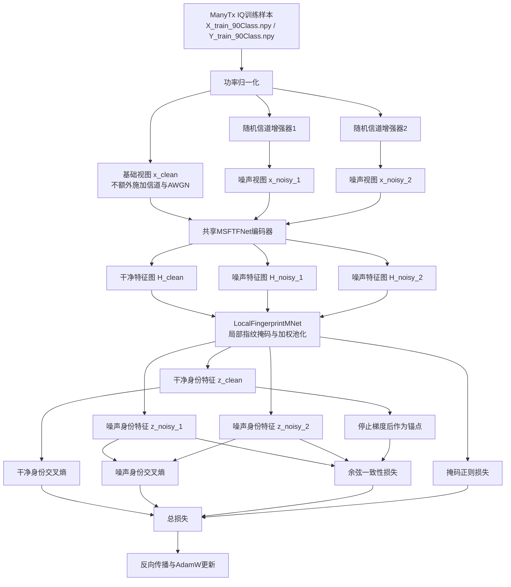

# RobustSEI_CleanAnchor 完整方案说明

> 代码版本：NEW3，提交 `50ab4d2`  
> 正式训练入口：`train_clean_anchor.py`  
> 默认特征提取器：`MSFTFNet`  
> 默认数据集：`ManyTx`  
> 主要目标：在尽量保持正常条件识别性能的同时，提高模型在低信噪比、衰落和多径干扰下的特定辐射源识别能力。

---

## 1. 为什么需要这个方案

特定辐射源识别（Specific Emitter Identification，SEI）的目标，是根据接收信号中由发射机硬件差异产生的细微特征判断信号来自哪一台设备。

这些个体差异通常非常微弱。实际接收信号还会受到以下因素影响：

- 接收噪声；
- 信号幅度变化；
- 随机相位变化；
- Rayleigh 衰落；
- Rician 衰落；
- 多径传播；
- 训练环境与测试环境的信噪比差异。

原有 MSFTFNet 在正常测试条件下已经具有较高识别率，但低信噪比结果明显下降：

| 条件 | 原 MSFTFNet Accuracy |
|---|---:|
| 无额外测试噪声 | 90.97% |
| -10 dB | 9.98% |
| -5 dB | 42.63% |
| 0 dB | 79.23% |
| 5 dB | 89.14% |
| 10 dB | 90.58% |
| 15 dB | 90.86% |
| 20 dB | 90.91% |

因此，本方案解决的核心问题是：

> 如何让模型学习在干净条件和低信噪比条件下都保持稳定的设备身份特征，同时避免从训练第一轮开始就加入过强噪声而破坏正常条件的识别能力。

---

## 2. 方案的核心思想

本方案包含两个相互配合的核心模块。

### 2.1 干净锚点一致性学习

同一个原始样本构造三种输入：

1. 一个未额外施加信道和 AWGN 的基础视图；
2. 一个随机信道噪声视图；
3. 另一个独立生成的随机信道噪声视图。

基础视图提取出的身份特征作为“干净锚点”。两个受扰视图的身份特征都需要向该锚点靠近。

这样做的目的不是让所有特征完全相同，而是让同一设备在不同噪声和信道条件下仍然落在相近的身份特征区域。

### 2.2 渐进式低信噪比课程训练

训练不是一开始就加入 `-10 dB` 的强噪声，而是按照从易到难的顺序逐渐降低最低训练 SNR：

| 训练阶段 | Epoch | 可采样 SNR |
|---|---:|---|
| 第一阶段 | 1～20 | 0、5、10、15、20 dB |
| 第二阶段 | 21～60 | -5、0、5、10、15、20 dB |
| 第三阶段 | 61～120 | -10、-5、0、5、10、15、20 dB |

每个阶段内部，从对应的离散 SNR 集合中均匀随机采样。

课程训练的作用是：

- 前期先建立基本的设备身份判别边界；
- 中期学习抵抗中等噪声；
- 后期再适应极低信噪比；
- 降低强噪声过早干扰身份特征学习的风险。

---

## 3. 整体流程



---

## 4. 数据集和数据加载

### 4.1 默认文件位置

Linux 服务器默认数据目录：

```text
~/Datasets/ManyTx
```

预训练使用：

```text
~/Datasets/ManyTx/X_train_90Class.npy
~/Datasets/ManyTx/Y_train_90Class.npy
```

最终整体测试和分 SNR 测试使用：

```text
~/Datasets/ManyTx/X_test_90Class.npy
~/Datasets/ManyTx/Y_test_90Class.npy
```

少样本下游实验使用 30 类文件：

```text
X_train_30Class.npy
Y_train_30Class.npy
X_test_30Class.npy
Y_test_30Class.npy
```

### 4.2 输入格式

模型要求 IQ 输入形状为：

```text
[样本数, 2, 信号长度]
```

其中：

- 第 0 个通道为 I 路；
- 第 1 个通道为 Q 路；
- 若原始数据形状为 `[样本数, 信号长度, 2]`，加载器会自动转置；
- 最多读取每个样本前 4800 个采样点。

### 4.3 内存映射

预训练通过：

```python
np.load(path, mmap_mode="r")
```

读取大规模 `.npy` 文件。这意味着程序不会一次把整个训练集全部载入内存，而是在每个 batch 需要时按索引读取。

### 4.4 训练集与验证集划分

预训练只从 `X_train_90Class.npy` 中进行划分：

- 80% 作为预训练训练集；
- 20% 作为预训练验证集；
- `random_state=2024`；
- 使用类别分层抽样 `stratify=labels`。

`X_test_90Class.npy` 不参与预训练和模型选择，只用于最后评估。

这可以避免直接使用最终测试集选择模型造成测试泄漏。

### 4.5 功率归一化

每个 IQ 样本计算：

```text
Pmax = max(I² + Q²)
```

然后执行：

```text
x_normalized = x / sqrt(Pmax)
```

代码通过 `1e-12` 防止除零。

### 4.6 关于“干净锚点”的准确含义

数据加载器会生成 8 个局部相位旋转视图。当前训练代码取：

```python
mixed_inputs = signals[:, 0]
```

作为基础视图。

因此，本文档中的“干净锚点”严格来说是：

> 没有额外施加随机幅相扰动、衰落、多径和 AWGN 的基础增强视图。

它仍然包含数据加载阶段生成的局部相位旋转，并不是磁盘中完全未经增强的原始波形。论文中建议称为“clean/base view”或“无额外信道扰动视图”，不要声称它是绝对无噪声信号。

---

## 5. 随机信道与噪声增强

每个训练样本独立生成两个随机受扰视图。两个视图使用相同设备标签，但增强参数独立采样。

### 5.1 随机相位与幅度

相位偏移：

```text
phase ~ Uniform(-0.25, 0.25) rad
```

幅度缩放：

```text
amplitude ~ Uniform(0.8, 1.2)
```

IQ 复数旋转形式为：

```text
I' = cos(phase) * I - sin(phase) * Q
Q' = sin(phase) * I + cos(phase) * Q
```

最后乘以随机幅度。

### 5.2 随机衰落

每个样本等概率选择：

```text
无衰落 / Rayleigh衰落 / Rician衰落
```

Rician 默认 K 因子为：

```text
K = 3
```

### 5.3 随机多径

每个样本以 50% 概率施加多径：

```text
delay ~ IntegerUniform(1, 8)
gain  ~ Uniform(0.05, 0.25)
```

多径输出近似为：

```text
x_multipath(t) = x(t) + gain * x(t-delay)
```

### 5.4 AWGN

先计算当前受扰信号自身的平均功率：

```text
Psignal = mean(x²)
```

根据目标 SNR 得到噪声功率：

```text
Pnoise = Psignal / 10^(SNR/10)
```

再生成同形状高斯噪声：

```text
x_noisy = x + Normal(0, 1) * sqrt(Pnoise)
```

每个样本独立采样 SNR，因此同一 batch 内可以同时出现不同信噪比。

### 5.5 课程阶段的实现

代码中 epoch 从 0 开始计数，因此默认条件实际为：

```python
if epoch < 20:
    minimum_snr = 0
elif epoch < 60:
    minimum_snr = -5
else:
    minimum_snr = -10
```

对应日志中看到的 Epoch 为：

```text
Epoch 1～20
Epoch 21～60
Epoch 61～120
```

### 5.6 验证阶段的增强范围

课程筛选只在：

```python
training == True
```

时生效。

验证阶段从第 1 轮开始就使用完整集合：

```text
-10、-5、0、5、10、15、20 dB
```

并同样包含随机幅相、衰落和多径。

因此训练日志里的 `Val SEI-Acc` 是混合随机干扰条件下的准确率，不是无额外噪声测试准确率。

---

## 6. MSFTFNet 特征提取器

MSFTFNet 是多尺度时频特征编码器，输入为 IQ 波形，输出局部时序特征图。

### 6.1 默认参数

| 参数 | 数值 |
|---|---:|
| IQ 通道数 | 2 |
| `seq_len` | 256 |
| `patch_size` | 16 |
| 卷积步长 | 8 |
| 嵌入维度 | 128 |
| Transformer 深度 | 3 |
| 注意力头数 | 4 |
| FFN 维度 | 512 |
| Dropout | 0.3 |
| 输出全局特征维度 | 1024 |

`seq_len=256` 在当前 MSFTFNet 中主要用于计算目标 token 数：

```text
num_patches = (256 - 16) / 8 + 1 = 31
```

原始波形仍可以是 4800 点。时间分支和频率分支最后都会通过自适应池化压缩为 31 个位置。

### 6.2 时间分支

时间分支处理原始 `[I,Q]` 波形：

1. 一维卷积，卷积核 16，步长 8；
2. 两个多尺度时序块；
3. 自适应平均池化到 31 个位置。

每个多尺度块包含四条并行分支：

```text
kernel=3
kernel=5
kernel=9
kernel=3, dilation=2
```

四条分支拼接后通过 `1x1` 卷积融合，并与输入形成残差连接。

### 6.3 频率分支

先把 IQ 信号构造为复数：

```text
x_complex = I + jQ
```

然后执行正交归一化 FFT，只保留正频率部分。频率输入由两部分组成：

```text
log(1 + |FFT(x)|)
cos(angle(FFT(x)))
```

频率分支包括：

1. 卷积核为 5 的一维卷积；
2. 一个多尺度时序块；
3. 自适应平均池化到 31 个位置。

### 6.4 自适应时频融合

分别对时间特征图和频率特征图做全局平均，拼接后送入门控网络：

```text
[time_summary, frequency_summary]
        -> Linear
        -> GELU
        -> Linear
        -> Softmax
```

得到时间权重和频率权重：

```text
w_time + w_freq = 1
```

最终融合为：

```text
H_fused = w_time * H_time + w_freq * H_frequency
```

### 6.5 Transformer 编码

融合后的 31 个 token 加上可学习位置编码：

```text
H = H_fused + PositionEmbedding
```

再经过 3 层 Transformer Encoder 和 LayerNorm，输出：

```text
H ∈ R^(B x 128 x 31)
```

CleanAnchor 训练使用的是这个局部特征图，而不是 MSFTFNet 最后的 1024 维全局 head 输出。

---

## 7. LocalFingerprintMNet 局部指纹选择

LocalFingerprintMNet 接收：

```text
H ∈ R^(B x 128 x 31)
```

并学习一个同形状软掩码：

```text
M ∈ (0,1)^(B x 128 x 31)
```

### 7.1 掩码网络

掩码网络结构：

```text
Conv1d(128 -> 64, kernel=3)
BatchNorm
ReLU
Conv1d(64 -> 32, kernel=3)
ReLU
Conv1d(32 -> 128, kernel=1)
Sigmoid
```

### 7.2 指纹加权池化

身份指纹为：

```text
z = Sum(H * M) / Sum(M)
```

输出维度：

```text
z ∈ R^(B x 128)
```

当前 `RobustSEI_CleanAnchor` 的：

```text
fusion_mode = fingerprint
use_multiscale = False
use_global_head = False
use_cosine_head = False
```

因此身份分类器是：

```text
Dropout(0.3) -> Linear(128, 90)
```

### 7.3 当前没有进行显式解耦

LocalFingerprintMNet 中仍保留环境分类头和剩余特征相关代码，以兼容历史方案，但 CleanAnchor 的损失列表只有：

```text
ID
CLEAN_CONS
MASK
```

因此：

- 环境对抗头不参与当前优化目标；
- 不使用 `z_rest` 解耦损失；
- 不应把当前方案描述为显式身份/环境解耦；
- 当前方案属于噪声鲁棒身份特征学习。

---

## 8. 三项损失函数

设：

- 设备标签为 `y`；
- 干净锚点身份特征为 `z_c`；
- 两个噪声身份特征为 `z_1`、`z_2`；
- 对应分类 logits 为 `p_c`、`p_1`、`p_2`。

### 8.1 身份分类损失 ID

噪声视图 logits 在 batch 维拼接：

```text
p_n = concat(p_1, p_2)
y_n = concat(y, y)
```

身份损失为：

```text
L_ID = 1.0 * CE(p_c, y) + 0.5 * CE(p_n, y_n)
```

含义：

- 干净锚点分类是主要监督；
- 噪声视图也必须能预测正确设备；
- 干净监督权重高于噪声监督，避免模型为了适应强噪声而明显损害正常条件性能。

### 8.2 干净锚点一致性损失 CLEAN_CONS

干净特征在一致性分支中执行停止梯度：

```text
stopgrad(z_c)
```

单个噪声视图的一致性距离为：

```text
d(z_i, z_c) = 1 - cosine(z_i, stopgrad(z_c))
```

总一致性损失为：

```text
L_CONS = 0.2 * 0.5 * [
    1 - cosine(z_1, stopgrad(z_c))
    +
    1 - cosine(z_2, stopgrad(z_c))
]
```

停止梯度非常重要：

- 干净锚点不会被一致性损失反向拖向噪声特征；
- 噪声特征主动向干净特征靠近；
- 干净分支仍然通过身份交叉熵正常更新。

### 8.3 掩码正则损失 MASK

掩码正则包含区域约束和总变差约束。

掩码平均值：

```text
m = mean(M)
```

期望掩码平均激活位于：

```text
[0.10, 0.40]
```

区域损失：

```text
L_area =
ReLU(0.10 - m)^2
+
ReLU(m - 0.40)^2
```

时间平滑损失：

```text
L_TV = mean(|M[..., t+1] - M[..., t]|)
```

单个掩码正则为：

```text
R(M) = L_area + 0.1 * L_TV
```

两个噪声视图的掩码损失为：

```text
L_MASK = 0.02 * 0.5 * [R(M_1) + R(M_2)]
```

### 8.4 总损失

当前方案不使用自动多任务损失加权，而是直接求和：

```text
L_TOTAL = L_ID + L_CONS + L_MASK
```

这样可以避免自动损失权重改变设定好的干净监督、噪声监督和一致性比例。

---

## 9. 一次训练迭代到底发生了什么

对于每一个 batch：

1. 从磁盘按索引读取 IQ 样本和设备标签；
2. 执行功率归一化；
3. 从加载器生成的视图中取基础视图；
4. 根据当前 epoch 确定最低可用 SNR；
5. 独立构造两个随机信道噪声视图；
6. 三个视图分别经过共享 MSFTFNet；
7. 得到三个 `[B,128,31]` 特征图；
8. 三个特征图分别经过共享 LocalFingerprintMNet；
9. 计算干净身份分类损失；
10. 计算两个噪声视图身份分类损失；
11. 计算噪声特征到停止梯度干净锚点的一致性损失；
12. 计算两个噪声视图的掩码正则；
13. 三项损失直接相加；
14. 反向传播；
15. 对全部训练参数执行最大范数为 5.0 的梯度裁剪；
16. AdamW 更新参数；
17. 每轮训练结束后，在验证集上执行完整 SNR 范围随机干扰验证；
18. 若验证 SEI Accuracy 更高，则保存新的 best 权重。

---

## 10. 优化器和训练参数

| 参数 | 默认值 |
|---|---:|
| Epoch | 120 |
| Batch size | 128 |
| 初始学习率 | 0.001 |
| 优化器 | AdamW |
| Weight decay | 0.0001 |
| 学习率调度 | StepLR |
| Step size | 50 |
| Gamma | 0.1 |
| 梯度裁剪 | 5.0 |
| 随机种子 | 2024 |

学习率变化：

| Epoch | 学习率 |
|---|---:|
| 1～50 | 0.001 |
| 51～100 | 0.0001 |
| 101～120 | 0.00001 |

---

## 11. 模型保存逻辑

每轮验证结束后，使用验证集 `SEI-Acc` 判断最佳模型。

如果当前验证准确率更高，则保存：

```text
best_encoder.pth
best_lfdb.pth
best_id_classifier.pth
```

每轮还会更新：

```text
final_encoder.pth
final_lfdb.pth
final_id_classifier.pth
checkpoint.pth
```

CleanAnchor 的设备分类头位于 `best_lfdb.pth` 内。`best_id_classifier.pth` 是兼容历史流程保存的外部分类器，在当前 LocalFingerprintMNet 评估路径中不作为最终身份头使用。

默认公共模型目录：

```text
runs/Pretext_RobustSEI_CleanAnchor_random_rot/
MSFTFNet_manytx_iq_powerNorm_RobustSEI_CleanAnchor/
```

每次运行还会创建带日期时间的子目录，用于保存该次实验日志和权重。

---

## 12. 服务器完整运行步骤

### 12.1 更新代码

```bash
cd ~/yl/NP3MC/NEW3
git pull
conda activate p3mc
git log -1 --oneline
```

应包含：

```text
50ab4d2 Add clean-anchor low-SNR curriculum training
```

### 12.2 检查数据

```bash
ls -lh ~/Datasets/ManyTx/X_train_90Class.npy
ls -lh ~/Datasets/ManyTx/Y_train_90Class.npy
ls -lh ~/Datasets/ManyTx/X_test_90Class.npy
ls -lh ~/Datasets/ManyTx/Y_test_90Class.npy
```

### 12.3 五轮流程测试

短测试需要提前课程边界，确保 5 轮内三个阶段都能被执行：

```bash
nohup python train_clean_anchor.py \
  --epoch 5 \
  --low_snr_start_epoch 2 \
  --very_low_snr_start_epoch 4 \
  > train_clean_anchor_test.log 2>&1 &
```

查看：

```bash
tail -f train_clean_anchor_test.log
```

测试通过标准：

- 没有 `Traceback`；
- 没有 NaN 或 Inf；
- 日志包含 `ID`、`CLEAN_CONS`、`MASK`；
- 最后出现 `End. Best Record`。

已经完成的 5 轮测试结果为：

```text
Val SEI-Acc: 22.90% -> 26.96% -> 30.13% -> 33.45% -> 37.23%
Val ID Loss: 3.3637 -> 2.0511
```

该结果只证明流程和数值稳定，不代表正式模型性能。

### 12.4 正式训练

正式训练不要携带短测试的课程边界：

```bash
cd ~/yl/NP3MC/NEW3
conda activate p3mc
rm -f train_clean_anchor_full.log

nohup python train_clean_anchor.py \
  > train_clean_anchor_full.log 2>&1 &
```

查看进程：

```bash
ps -ef | grep "[t]rain_clean_anchor.py"
```

查看实时日志：

```bash
tail -f train_clean_anchor_full.log
```

按 `Ctrl+C` 只退出 `tail`，不会停止后台训练。

查看关键记录：

```bash
grep -E "Epoch|Val Set|Best Record|End." train_clean_anchor_full.log | tail -30
```

按当前服务器速度，预计约需 2 小时 20 分钟到 2 小时 40 分钟。

### 12.5 中断后恢复

先检查 checkpoint：

```bash
ls -lh runs/Pretext_RobustSEI_CleanAnchor_random_rot/MSFTFNet_manytx_iq_powerNorm_RobustSEI_CleanAnchor/checkpoint.pth
```

然后恢复：

```bash
nohup python train_clean_anchor.py \
  --resume runs/Pretext_RobustSEI_CleanAnchor_random_rot/MSFTFNet_manytx_iq_powerNorm_RobustSEI_CleanAnchor/checkpoint.pth \
  > train_clean_anchor_resume.log 2>&1 &
```

checkpoint 在每轮结束时保存。因此若在某一轮中间停止，会从上一轮完整 checkpoint 继续。

---

## 13. 正式评估

### 13.1 无额外测试噪声

```bash
python evaluate_robust_sei.py \
  -e MSFTFNet \
  -d manytx \
  --method_name RobustSEI_CleanAnchor \
  --checkpoint best
```

输出：

```text
acc
macro_f1
run_root
snr
```

这里的“无额外测试噪声”不表示原始数据绝对无噪声，而是评估脚本不再人工添加 AWGN。

### 13.2 分 SNR 测试

```bash
python evaluate_snr.py \
  -e MSFTFNet \
  -d manytx \
  --method_name RobustSEI_CleanAnchor \
  --checkpoint best
```

默认测试：

```text
-10、-5、0、5、10、15、20 dB
```

评估脚本会在已归一化测试信号上人工添加对应 AWGN，然后报告：

```text
Accuracy
Macro-F1
```

### 13.3 为什么使用 best 而不是 final

`best` 是验证集混合干扰准确率最高的模型；`final` 是最后一轮模型。

正式主结果优先报告：

```text
--checkpoint best
```

同时可以补充 final 结果检查模型是否在训练后期退化。

---

## 14. 少样本下游评估

### 14.1 普通 Prototype

建议运行 10 个随机种子：

```bash
nohup python downstream_lr.py \
  -e MSFTFNet \
  -d manytx \
  -s 1 5 10 \
  -i 10 \
  --feature_dim 1024 \
  --TSLA_len 256 \
  --TSLA_patch 16 \
  --TSLA_emb 128 \
  --use_lfdb_features \
  --method_name RobustSEI_CleanAnchor \
  --eval_classifier prototype \
  > downstream_clean_anchor_proto_i10.log 2>&1 &
```

查看：

```bash
tail -f downstream_clean_anchor_proto_i10.log
```

汇总：

```bash
grep "Mean Acc" downstream_clean_anchor_proto_i10.log
```

Prototype 的计算过程：

1. 提取每个支持样本的 128 维身份特征；
2. L2 归一化；
3. 对同一类别特征求平均，得到类别原型；
4. 再次归一化原型；
5. 用测试特征与所有类别原型的余弦相似度分类。

### 14.2 Prototype + DCFA

```bash
nohup python downstream_lr.py \
  -e MSFTFNet \
  -d manytx \
  -s 1 5 10 \
  -i 10 \
  --feature_dim 1024 \
  --TSLA_len 256 \
  --TSLA_patch 16 \
  --TSLA_emb 128 \
  --use_lfdb_features \
  --method_name RobustSEI_CleanAnchor \
  --eval_classifier prototype \
  --use_dcfa \
  --aux_dataset manytx \
  > downstream_clean_anchor_calproto_i10.log 2>&1 &
```

当前旧模型实验表明：

- DCFA 对 1-shot Accuracy 有明显帮助；
- 对 5-shot 和 10-shot 未表现出稳定增益；
- 因此新模型也必须同时报告“无 DCFA”和“有 DCFA”，不能只选择更高的一组。

---

## 15. 需要报告的指标

### 15.1 基本识别指标

- Accuracy；
- Macro-F1；
- 每类 Precision；
- 每类 Recall；
- 每类 F1；
- 混淆矩阵。

### 15.2 低信噪比指标

必须分别报告：

```text
-10、-5、0、5、10、15、20 dB Accuracy
-10、-5、0、5、10、15、20 dB Macro-F1
```

建议再计算：

```text
Low-SNR Mean = Mean(-10, -5, 0 dB)
All-SNR Mean = Mean(-10, -5, 0, 5, 10, 15, 20 dB)
Worst-SNR Accuracy = Accuracy at -10 dB
```

### 15.3 少样本指标

对 1-shot、5-shot、10-shot 分别报告：

```text
Mean Accuracy ± Standard Deviation
Mean Macro-F1 ± Standard Deviation
```

正式实验至少 5 次，建议 10 次。

### 15.4 特征稳定性指标

为了证明一致性学习确实有效，建议增加：

- 同一样本干净/噪声特征余弦相似度；
- 不同 SNR 下同一设备特征中心漂移；
- 类内距离；
- 类间距离；
- Fisher 判别比；
- t-SNE 或 UMAP 可视化。

仅有分类准确率提高，还不足以直接证明特征一致性机制按照预期工作。

### 15.5 计算代价

建议报告：

- 参数量；
- FLOPs 或 MACs；
- 单样本推理时间；
- GPU 显存；
- 每轮训练时间。

当前训练阶段同一样本需要经过一个基础视图和两个噪声视图，因此训练计算量高于单视图模型；推理阶段只使用一个测试视图，不需要三次前向。

---

## 16. 如何判断方案成功

原 MSFTFNet 基线：

| 指标 | 基线 |
|---|---:|
| 无额外噪声 Accuracy | 90.97% |
| 无额外噪声 Macro-F1 | 91.55% |
| -10 dB Accuracy | 9.98% |
| -5 dB Accuracy | 42.63% |
| 0 dB Accuracy | 79.23% |
| 低 SNR 平均 Accuracy | 43.95% |
| 全 SNR 平均 Accuracy | 70.48% |

### 16.1 最低工程成功标准

| 指标 | 最低要求 |
|---|---:|
| 无额外噪声 Accuracy | ≥ 90.0% |
| -10 dB Accuracy | ≥ 12% |
| -5 dB Accuracy | ≥ 47% |
| 0 dB Accuracy | ≥ 80% |
| 低 SNR 平均 Accuracy | ≥ 47% |
| 正常条件下降 | 不超过 1 个百分点 |

### 16.2 较有论文价值的目标

| 指标 | 推荐目标 |
|---|---:|
| 无额外噪声 Accuracy | ≥ 90.5% |
| -10 dB Accuracy | ≥ 15% |
| -5 dB Accuracy | ≥ 50% |
| 0 dB Accuracy | ≥ 82% |
| 低 SNR 平均 Accuracy | ≥ 49% |
| 全 SNR 平均 Accuracy | ≥ 73% |

真正的成功应同时满足：

1. 低 SNR 结果稳定提高；
2. 无额外噪声和高 SNR 性能基本不下降；
3. Macro-F1 与 Accuracy 同步改善；
4. 多随机种子结果方差可接受；
5. 消融实验能分别证明课程训练和干净锚点一致性的作用。

如果 `-10/-5 dB` 提高，但无额外噪声 Accuracy 从约 91% 降到 86%，不能认为整体方案成功。

---

## 17. 必须进行的消融实验

为了公平证明两个核心模块，需要保持：

- 相同数据划分；
- 相同 MSFTFNet；
- 相同训练轮数；
- 相同 batch size；
- 相同优化器；
- 相同随机种子；
- 相同评估脚本。

建议四组：

| 实验 | 课程训练 | 一致性损失 |
|---|---|---|
| A：基础控制组 | 否 | 否 |
| B：仅课程训练 | 是 | 否 |
| C：仅一致性 | 否 | 是 |
| D：完整方案 | 是 | 是 |

### 17.1 A：无课程、无一致性

```bash
nohup python train_clean_anchor.py \
  --method_name RobustSEI_CleanAnchor_NoCurr_NoCons \
  --low_snr_start_epoch 0 \
  --very_low_snr_start_epoch 0 \
  --clean_cons_weight 0 \
  > ablation_no_curr_no_cons.log 2>&1 &
```

### 17.2 B：只有课程训练

```bash
nohup python train_clean_anchor.py \
  --method_name RobustSEI_CleanAnchor_CurrOnly \
  --clean_cons_weight 0 \
  > ablation_curr_only.log 2>&1 &
```

### 17.3 C：只有一致性

```bash
nohup python train_clean_anchor.py \
  --method_name RobustSEI_CleanAnchor_ConsOnly \
  --low_snr_start_epoch 0 \
  --very_low_snr_start_epoch 0 \
  > ablation_cons_only.log 2>&1 &
```

### 17.4 D：完整方案

```bash
nohup python train_clean_anchor.py \
  > train_clean_anchor_full.log 2>&1 &
```

消融实验不能只比较预训练验证准确率，必须对每组都执行相同的无额外噪声、分 SNR 和少样本评估。

---

## 18. 日志如何理解

示例：

```text
Val Set:
SEI-Acc: 37.23%,
ID: 2.051094,
CLEAN_CONS: 0.078172,
MASK: 0.000087,
TOTAL: 2.129353
```

含义：

- `SEI-Acc`：两个噪声视图的设备识别准确率；
- `ID`：加权后的干净和噪声身份交叉熵；
- `CLEAN_CONS`：已经乘以 0.2 权重的一致性损失；
- `MASK`：已经乘以 0.02 权重的掩码正则；
- `TOTAL`：三者之和。

`Rot-Acc=0` 和 `Mixed-Acc=0` 在当前方案中是正常现象，因为这两个历史任务不在 CleanAnchor 的损失列表中。

### 18.1 正常现象

- 引入 -5 dB 或 -10 dB 的阶段边界后，训练 Accuracy 短暂下降；
- `CLEAN_CONS` 在更强噪声加入后暂时升高；
- 随后 Accuracy 恢复并继续上升；
- 验证 Accuracy 有小幅随机波动。

### 18.2 异常现象

- `ID` 突然达到几百、几万；
- Loss 出现 NaN 或 Inf；
- Accuracy 长期接近随机猜测 `1/90≈1.11%`；
- 课程切换后连续十几轮无法恢复；
- 日志出现 `Traceback`；
- 找不到 `best_encoder.pth` 或 `best_lfdb.pth`。

---

## 19. 当前方案的边界和不能过度声称的内容

### 19.1 当前不是显式解耦方案

本方案不再以身份/信道完全解耦为目标。它学习的是噪声条件下稳定的身份表示。

### 19.2 低 SNR 测试主要是人工 AWGN

`evaluate_snr.py` 在测试集上人工添加 AWGN。该实验可以证明模型对指定高斯噪声强度的鲁棒性，但不能单独证明：

- 对所有真实噪声类型都鲁棒；
- 对全新接收机环境鲁棒；
- 对未见过的真实信道完全泛化。

高水平论文还应增加：

- 未参与训练的噪声类型；
- 不同多径参数；
- 不同衰落参数；
- 跨采集时间；
- 跨接收位置；
- 跨接收机或跨数据集测试。

### 19.3 验证增强具有随机性

验证阶段会随机生成信道和噪声视图，因此单轮验证准确率存在随机波动。最终结论应以固定测试脚本、多随机种子均值和标准差为准。

### 19.4 MSFTFNet 本身不能直接作为全部创新

多尺度卷积、时频双分支、门控融合和 Transformer 都有相关研究基础。论文中的贡献应具体落在：

1. 面向低 SNR SEI 的干净锚点特征一致性机制；
2. 与身份保持目标协同的渐进式 SNR 课程。

必须通过消融和公平基线证明这两个模块，而不是仅凭组合结构声称创新。

---

## 20. 推荐的最终实验表格

### 20.1 主结果

| 方法 | Clean Acc | Clean F1 | -10 dB | -5 dB | 0 dB | 5 dB | All-SNR Mean |
|---|---:|---:|---:|---:|---:|---:|---:|
| CVTSLANet |  |  |  |  |  |  |  |
| MSFTFNet Baseline | 90.97 | 91.55 | 9.98 | 42.63 | 79.23 | 89.14 | 70.48 |
| CleanAnchor |  |  |  |  |  |  |  |

### 20.2 消融

| Curriculum | Clean Consistency | Clean Acc | -10 dB | -5 dB | 0 dB | Low-SNR Mean |
|---|---|---:|---:|---:|---:|---:|
| 否 | 否 |  |  |  |  |  |
| 是 | 否 |  |  |  |  |  |
| 否 | 是 |  |  |  |  |  |
| 是 | 是 |  |  |  |  |  |

### 20.3 少样本

| 方法 | 1-shot Acc/F1 | 5-shot Acc/F1 | 10-shot Acc/F1 |
|---|---:|---:|---:|
| Prototype |  |  |  |
| Prototype + DCFA |  |  |  |

每项填写 `Mean ± Std`。

---

## 21. 一句话概括

RobustSEI_CleanAnchor 使用 MSFTFNet 从 IQ 信号中提取多尺度时频特征，以未额外施加信道干扰的基础视图作为身份锚点，通过干净与噪声身份分类、停止梯度的余弦特征一致性以及局部指纹掩码正则进行联合训练，并按照 `0 dB -> -5 dB -> -10 dB` 的顺序逐步增加训练难度，从而在尽量保持正常条件识别能力的同时提升低信噪比 SEI 鲁棒性。

