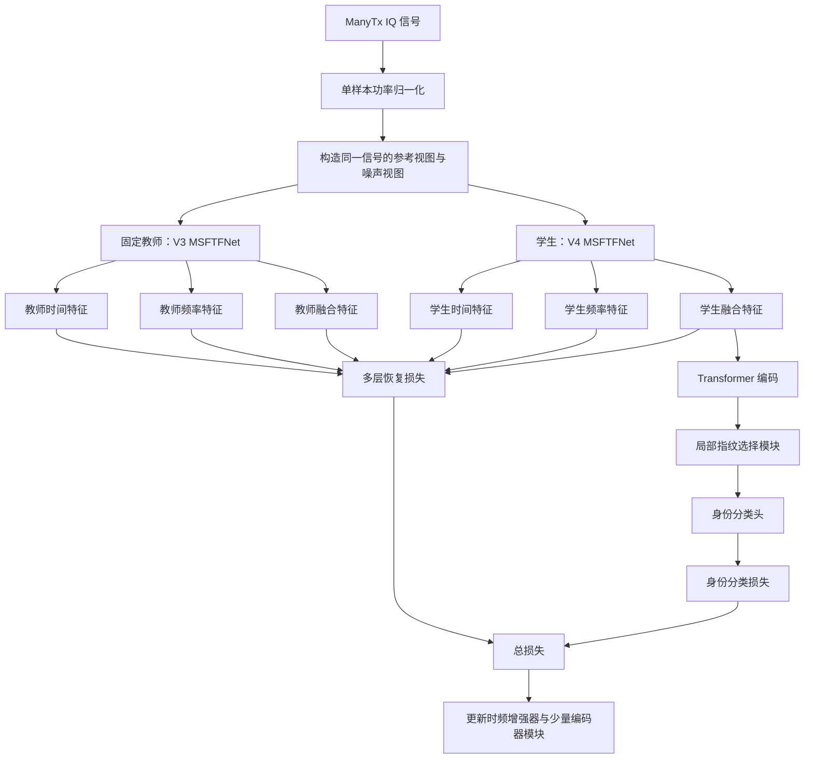

# RobustSEI 低信噪比多层时频恢复方案：全面理解版

> 当前正式主方案：`RobustSEI_CleanAnchorV4_MultiLevelRestore`
>
> 当前特征提取器：`MSFTFNet`
>
> 数据集：`ManyTx`
>
> 主任务：90 类闭集低信噪比辐射源个体识别
>
> 后续任务：30 类 1/5/10-shot 少样本识别
>
> 文档状态：根据当前代码与 60 轮正式结果整理
>
> 更新日期：2026-07-30

---

## 0. 阅读这份文档前先明确三件事

### 0.1 当前正式方案是 V4

已经完成正式训练和重复评估、可以作为当前实验主线的是：

```text
RobustSEI_CleanAnchorV4_MultiLevelRestore
```

对应训练入口：

```text
train_multilevel_restore.py
```

### 0.2 V5 目前只是待验证实验

下面这个版本是为了进一步提高 `-10 dB` 准确率而增加的定向微调：

```text
RobustSEI_CleanAnchorV5_MultiLevelRestore_ExtremeTune
```

对应入口：

```text
train_multilevel_extreme_tune.py
```

它尚未产生正式结果，因此不能把 V5 写成已经验证的贡献。

### 0.3 当前方案不再以“解耦”为核心

早期实验尝试把指纹特征与环境特征分开，但 `z_fp`、`z_rest` 等分支仍然保留了很高的身份识别能力，无法形成充分的解耦证据。

当前方案已经转向：

```text
低信噪比条件下的多尺度时频指纹提取与多层特征恢复
```

因此：

- 不应继续把“成功解耦”作为主要结论；
- `evaluate_branches.py` 不再是 V4 的核心评估；
- 当前核心指标是不同 SNR 下的 Accuracy 和 Macro-F1。

---

## 1. 方案到底解决什么问题

### 1.1 什么是特定辐射源个体识别

特定辐射源个体识别（Specific Emitter Identification，SEI）试图根据接收到的无线电信号，判断信号来自哪一个具体发射设备。

即使多个设备：

- 型号相同；
- 协议相同；
- 调制方式相同；
- 发射内容相似；

它们的功率放大器、振荡器、数模转换器、滤波器等硬件仍存在细微制造误差。这些误差会在信号中形成相对稳定的个体特征，通常称为：

```text
射频指纹
```

### 1.2 低信噪比为什么困难

当 SNR 降低时，噪声逐渐覆盖细微硬件失真。

粗粒度的调制结构可能仍然存在，但区分同型号设备所需的细粒度差异会首先被破坏。

因此会出现：

```text
Clean / 高 SNR：容易保留设备差异
0 dB：部分指纹被破坏
-5 dB：细粒度结构明显受损
-10 dB：噪声能量远高于可识别指纹
```

ManyTx 预训练评估是 90 分类，随机猜测准确率约为：

```text
1 / 90 = 1.11%
```

当前 V4 在 `-10 dB` 达到约 `11.98%`，明显高于随机猜测，但距离设定的 `15%` 目标仍有差距。

### 1.3 本方案的目标

本方案希望同时满足：

1. 保持无额外噪声条件下的身份识别性能；
2. 提高 `0 dB`、`-5 dB` 和 `-10 dB` 下的鲁棒性；
3. 不依赖大量新增损失函数；
4. 不从头破坏已经学到的身份判别空间；
5. 让改进能够通过清晰消融实验验证。

---

## 2. 一句话核心思想

> 使用固定的较强模型为同一信号提供无额外 AWGN 的时间、频率和融合特征参考，让学生网络在逐渐增强的噪声条件下恢复这些多层特征，同时利用身份分类损失防止恢复过程丢失设备判别信息。

---

## 3. 整体流程



---

## 4. 数据集与任务划分

### 4.1 ManyTx 配置

代码中的 ManyTx 配置为：

```text
预训练/鲁棒评估类别数：90
少样本下游类别数：30
Linux 数据目录：~/Datasets/ManyTx
输入类型：IQ
归一化：power
```

90 类鲁棒评估与 30 类少样本实验是两个不同任务，不能把两者结果混在同一张表中解释。

### 4.2 文件命名

预训练通常使用：

```text
X_train_90Class.npy
Y_train_90Class.npy
X_test_90Class.npy
Y_test_90Class.npy
```

少样本下游使用对应 30 类文件。

### 4.3 输入形状

原始单个 IQ 样本经过转置检查后统一为：

```text
[2, L]
```

其中：

- 通道 0：I 分量；
- 通道 1：Q 分量；
- 实际读取前 4800 个采样点。

批输入为：

```text
[B, 2, 4800]
```

### 4.4 功率归一化

每个样本计算：

```text
Pmax = max_t(I(t)^2 + Q(t)^2)
```

然后：

```text
x_norm = x / sqrt(Pmax)
```

作用：

- 减少绝对幅度差异；
- 避免模型仅依赖接收功率判断设备；
- 让不同样本进入相对一致的数值范围。

它不能消除所有信道影响，也不能把有噪声信号变成干净信号。

### 4.5 训练与验证划分

90 类训练文件内部按照：

```text
训练集：80%
验证集：20%
```

进行分层划分。

固定随机种子：

```text
2024
```

分层划分保证每个类别在训练集和验证集中均有样本。

### 4.6 相位旋转数据处理

`PretrainIQDataset` 会将一个信号构造为 8 个分段相位旋转版本。

但是 V4 的损失项只有：

```text
ID
MULTI_RESTORE
```

V4 训练路径实际使用：

```python
mixed_inputs = signals[:, 0]
```

也就是说，V4 主要使用第一个相位旋转版本进入教师—学生噪声配对路径，并没有训练旋转分类任务。

因此日志中的：

```text
Rot-Acc: 0.00%
Mixed-Acc: 0.00%
```

不代表模型崩溃，而是这两个任务没有包含在当前损失中。

---

## 5. “干净信号”到底是什么意思

当前代码中的 clean 不能理解为实验室理想无噪声波形。

准确含义是：

```text
从数据集读取并完成归一化/相位处理后，
没有再通过当前 AWGN 增强函数添加额外噪声的参考视图。
```

因此文档和论文中更严谨的术语是：

```text
无额外噪声参考视图
reference view without additional AWGN
```

不能直接声称：

- 数据本身完全没有接收噪声；
- 教师看到了真实物理无噪声信号；
- 模型恢复出了真实无噪声波形。

---

## 6. AWGN 生成方式

### 6.1 信号功率

对每个样本独立计算：

```text
P_signal = mean(x^2)
```

### 6.2 目标噪声功率

给定 SNR：

```text
P_noise = P_signal / 10^(SNR/10)
```

### 6.3 加噪

生成标准高斯噪声并按目标功率缩放：

```text
x_noisy = x + noise * sqrt(P_noise)
```

训练时每个样本独立抽取 SNR，每次生成新的随机噪声。

### 6.4 V4 使用的干扰类型

多层恢复路径调用：

```text
random_awgn_level_view
```

因此 V4 核心训练主要使用位置对齐的 AWGN，不包含该函数之外的：

- Rayleigh 衰落；
- Rician 衰落；
- 多径；
- 随机幅相扰动。

这也是当前方案的重要适用范围边界。

---

## 7. MSFTFNet 特征提取器

### 7.1 总体结构

```text
IQ 输入
├── 时间分支
├── 频率分支
├── 自适应时频增强器
├── 时频门控融合
├── Transformer 编码器
└── 局部指纹模块
```

主要配置：

```text
目标序列长度参数 seq_len = 256
patch_size = 16
输入通道 = 2
embedding dimension = 128
Transformer depth = 3
Transformer heads = 4
dropout = 0.3
```

注意：

```text
实际输入仍为 4800 个采样点。
seq_len=256 主要用于计算目标 token 数。
```

目标 token 数为：

```text
(256 - 16) / 8 + 1 = 31
```

两个分支最终均通过自适应池化得到：

```text
[B, 128, 31]
```

### 7.2 时间分支

时间分支直接接收：

```text
[B, 2, 4800]
```

首先执行：

```text
Conv1d(2 → 128, kernel=16, stride=8)
BatchNorm
GELU
```

然后串联两个多尺度时间块。

每个多尺度时间块包含四个并行分支：

```text
kernel = 3
kernel = 5
kernel = 9
kernel = 3, dilation = 2
```

四个分支结果拼接后经过 `1×1 Conv` 融合，并与输入做残差相加。

意义：

- 小卷积核捕获局部快速变化；
- 大卷积核捕获较长结构；
- 空洞卷积扩大感受野；
- 残差连接降低深层训练难度。

### 7.3 频率分支

先将 I/Q 组成复数信号：

```text
x_complex = I + jQ
```

执行复数 FFT：

```text
FFT(x_complex)
```

保留正频率侧，然后构造两个频域通道：

```text
log(1 + |X(f)|)
cos(angle(X(f)))
```

因此频域分支输入不是传统二维时频图，而是：

```text
[对数幅度, 相位余弦]
```

之后经过：

```text
Conv1d(2 → 128, kernel=5)
一个多尺度时间块
AdaptiveAvgPool1d(31)
```

输出：

```text
freq_map ∈ R^[B,128,31]
```

### 7.4 自适应时频增强器

模块名称：

```text
AdaptiveTFEnhancer
```

它分别从时间图和频率图提取：

```text
通道均值
通道标准差
```

拼接后预测两个可靠性系数：

```text
r_time
r_freq
```

每个系数位于 `[0,1]`。

时间和频率分别经过残差修正分支：

```text
GroupNorm
Depthwise Conv1d(kernel=5)
GELU
1×1 Conv
GELU
1×1 Conv
```

增强结果：

```text
time_enhanced = time_map + r_time × delta_time
freq_enhanced = freq_map + r_freq × delta_freq
```

最后一个投影层采用零初始化，因此训练开始时：

```text
delta_time ≈ 0
delta_freq ≈ 0
```

即增强器初始近似恒等映射，不会一开始破坏已有特征。

### 7.5 时频门控融合

分别对增强后的时间图和频率图做全局平均，拼接后通过 MLP 预测两个权重：

```text
w_time + w_freq = 1
```

融合：

```text
fused_map = w_time × time_map + w_freq × freq_map
```

权重是逐样本预测的，不是全数据固定常数。

### 7.6 Transformer 编码

将：

```text
[B,128,31]
```

转置为：

```text
[B,31,128]
```

加位置嵌入后进入 3 层 Transformer Encoder，再经过 LayerNorm。

最终局部特征图：

```text
feature_map ∈ R^[B,128,31]
```

---

## 8. LocalFingerprintMNet 的作用

### 8.1 指纹掩码

局部模块使用卷积网络预测：

```text
mask ∈ [0,1]^[B,128,31]
```

然后进行掩码加权池化：

```text
fingerprint =
sum(feature_map × mask) / sum(mask)
```

得到：

```text
fingerprint ∈ R^[B,128]
```

### 8.2 身份分类

V4 方法名不包含 `fusion`，默认：

```text
fusion_mode = fingerprint
```

因此身份特征就是：

```text
id_features = fingerprint
```

身份头为：

```text
Dropout(0.3)
Linear(128 → 90)
```

### 8.3 V4 中哪些旧分支没有参与主损失

LocalFingerprintMNet 还包含：

- 环境分类头；
- 剩余特征；
- 对抗分支接口；
- 掩码正则；
- 可选局部特征恢复块。

但 V4 总损失只包含：

```text
ID + MULTI_RESTORE
```

因此这些额外输出不是 V4 的核心训练目标。

### 8.4 一个容易忽略的实现细节

V4 方法会实例化 `LocalFingerprintMNet.feature_restorer`，但在多层恢复训练模式下：

- 整个 LFDB 被冻结；
- `feature_restorer` 初始为恒等残差；
- 真正参与训练的恢复模块是 `MSFTFNet.tf_enhancer`。

因此 V4 的核心恢复不能表述成“LFDB 特征恢复块在训练”，准确说法是：

```text
MSFTFNet 中的信号条件时频增强器接受多层教师监督。
```

---

## 9. 固定教师与学生

### 9.1 教师来源

V4 教师来自：

```text
runs/Pretext_RobustSEI_CleanAnchorV3_random_rot/
└── MSFTFNet_manytx_iq_powerNorm_RobustSEI_CleanAnchorV3/
```

加载：

```text
best_encoder.pth
best_lfdb.pth
```

### 9.2 旧权重兼容

V3 权重中没有后来新增的：

```text
tf_enhancer.*
```

加载器允许这些键缺失，并将新增增强器保留为零初始化恒等路径。

除此之外的意外缺失键或多余键仍会报错。

### 9.3 学生初始化

代码先把 V3 权重加载到学生，再复制出固定教师。

因此训练开始时：

```text
teacher ≈ student
```

差别在于：

- 教师始终冻结；
- 教师输入无额外 AWGN 参考视图；
- 学生输入噪声视图；
- 学生逐渐学习恢复。

### 9.4 为什么教师固定

如果教师跟着学生一起变化，参考目标会移动，可能出现：

- 教师和学生一起退化；
- 噪声特征互相拟合；
- 训练目标缺少稳定锚点。

固定教师提供相对稳定的参考空间。

### 9.5 教师不是标签生成器

当前教师主要提供：

```text
time_map
freq_map
fused_map
```

身份监督仍使用真实设备标签，不是教师伪标签。

---

## 10. 配对噪声视图

对同一个 `mixed_inputs` 独立生成两个噪声版本：

```text
view_1
view_2
```

二者：

- 来自同一基础信号；
- 身份标签相同；
- AWGN realization 不同；
- SNR 可以不同。

学生分别处理两个视图，教师处理同一个基础参考视图。

位置对齐非常重要，因为时间、频率和融合特征需要与同一信号的参考特征比较。

---

## 11. 低 SNR 课程训练

V4 共训练 60 个 epoch。

### 11.1 Epoch 1–10

训练 SNR：

```text
0 dB：50%
-5 dB：50%
```

目标：

- 先建立中低噪声恢复能力；
- 避免训练初期直接被 `-10 dB` 主导。

### 11.2 Epoch 11–30

训练比例：

```text
-5 dB：70%
-10 dB：30%
```

目标：

- 逐渐引入极低 SNR；
- 保持一定可学习的身份信息。

### 11.3 Epoch 31–60

训练比例：

```text
-10 dB：60%
-5 dB：30%
0 dB：10%
```

目标：

- 将训练重点转向 `-10 dB`；
- 保留少量较容易样本以减少灾难性退化。

### 11.4 验证分布

验证阶段不使用训练课程，而是固定均匀测试：

```text
-10 dB
-5 dB
0 dB
```

因此验证 `SEI-Acc` 更接近低 SNR 综合能力，而不是只反映当前训练采样比例。

---

## 12. 损失函数

V4 只有两项主损失：

```text
L_total = L_ID + L_MULTI_RESTORE
```

代码中使用手工求和，不使用自动多任务权重。

### 12.1 身份损失

身份损失同时包含：

```text
无额外 AWGN 学生视图的分类损失
两个噪声学生视图的分类损失
```

可写为：

```text
L_ID =
λ_clean × CE(y_clean, y)
+ λ_noisy × CE(y_noisy, y)
```

当前：

```text
λ_clean = 1.0
λ_noisy = 1.0
```

其中两个噪声视图的 logits 拼接后统一计算交叉熵。

作用：

- 保持正常信号身份可分性；
- 让噪声特征仍然具有身份判别能力；
- 防止模型只追求教师特征相似。

### 12.2 归一化特征图距离

对学生和教师特征图沿通道维做 L2 归一化：

```text
s_hat = normalize(s, dim=channel)
t_hat = normalize(t, dim=channel)
```

单层距离：

```text
D(s,t) = mean(1 - sum_channel(s_hat × t_hat))
```

它本质上是逐位置余弦距离的平均。

教师特征会 `detach`，不接收梯度。

### 12.3 多层恢复损失

分别比较：

```text
时间特征 time_map
频率特征 freq_map
融合特征 fused_map
```

对每个噪声视图：

```text
L_view =
(D_time + D_freq + D_fused) / 3
```

两个视图平均：

```text
L_restore_raw = (L_view1 + L_view2) / 2
```

最终：

```text
L_MULTI_RESTORE = 0.2 × L_restore_raw
```

### 12.4 为什么没有更多损失

当前没有继续加入：

- 对抗环境损失；
- 正交损失；
- 分支均匀损失；
- 掩码损失；
- 监督对比损失；
- 扩散生成损失。

原因是前期实验表明损失过多会增加：

- 参数敏感性；
- 梯度冲突；
- 训练崩溃风险；
- 消融解释难度。

---

## 13. 参数冻结与优化

### 13.1 完全冻结

以下模块不更新：

- 固定教师编码器；
- 固定教师 LFDB；
- 学生时间 stem；
- 学生频率 stem；
- 学生大部分 Transformer；
- 学生 LFDB，包括指纹掩码和身份分类头。

### 13.2 主要训练模块

主要更新：

```text
MSFTFNet.tf_enhancer
```

学习率：

```text
1e-4
```

### 13.3 选择性适配模块

以更小学习率更新：

```text
时频融合门
最后一层 Transformer
输出 LayerNorm
```

学习率：

```text
1e-5
```

### 13.4 模块模式

训练时整个学生编码器先切换到 `eval`，然后仅将：

- `tf_enhancer`；
- 融合模块；
- 最后一层 Transformer；
- 输出 LayerNorm；

切换回训练模式。

因此冻结 stem 中的 BatchNorm 统计量不会继续漂移。

### 13.5 优化器和调度器

优化器：

```text
AdamW
```

参数：

```text
主学习率 = 1e-4
encoder_adapt_lr = 1e-5
weight_decay = 1e-4
grad_clip = 5.0
```

学习率调度：

```text
StepLR(step_size=40, gamma=0.1)
```

第 40 轮后学习率下降 10 倍。

---

## 14. V4 正式配置

```text
method_name = RobustSEI_CleanAnchorV4_MultiLevelRestore
encoder = MSFTFNet
dataset = manytx
epoch = 60
batch_size = 128
feature_dim = 1024
clean_id_weight = 1.0
noisy_id_weight = 1.0
multilevel_restore_weight = 0.2
mask_weight = 0.0
low_snr_start_epoch = 10
very_low_snr_start_epoch = 30
restoration_only = True
selective_encoder_finetune = True
lr = 1e-4
encoder_adapt_lr = 1e-5
weight_decay = 1e-4
lr_step = 40
grad_clip = 5.0
```

---

## 15. 训练日志应该怎样理解

典型日志：

```text
Val Set:
Rot-Acc: 0.00%
SEI-Acc: xx.xx%
Mixed-Acc: 0.00%
ID: ...
MULTI_RESTORE: ...
TOTAL: ...
```

解释：

- `SEI-Acc`：当前验证噪声视图的设备身份准确率；
- `ID`：清洁学生分类与噪声学生分类的加权和；
- `MULTI_RESTORE`：已经乘以 `0.2` 的多层恢复损失；
- `TOTAL`：两者之和；
- `Rot-Acc/Mixed-Acc=0`：对应任务未启用，不代表故障。

最佳模型选择：

1. 优先验证 `SEI-Acc` 更高；
2. 如果准确率相同，选择损失更低者。

日志中的：

```text
Best Record: {'epoch': 59, ...}
```

使用零基索引，`epoch=59` 对应实际第 60 轮。

---

## 16. 模型保存文件

V4 根目录：

```text
runs/Pretext_RobustSEI_CleanAnchorV4_MultiLevelRestore_random_rot/
└── MSFTFNet_manytx_iq_powerNorm_RobustSEI_CleanAnchorV4_MultiLevelRestore/
```

主要文件：

```text
best_encoder.pth
best_lfdb.pth
best_id_classifier.pth
final_encoder.pth
final_lfdb.pth
final_id_classifier.pth
checkpoint.pth
```

含义：

- `best_*`：验证 SEI-Acc 最优 epoch；
- `final_*`：最后一个 epoch；
- `checkpoint.pth`：包含模型、优化器、调度器和训练轮次，用于恢复训练。

评估优先使用：

```text
--checkpoint best
```

---

## 17. 评估流程

### 17.1 无额外噪声测试

```bash
python evaluate_robust_sei.py \
  -e MSFTFNet -d manytx \
  --method_name RobustSEI_CleanAnchorV4_MultiLevelRestore \
  --checkpoint best
```

流程：

```text
测试IQ
→ power normalize
→ MSFTFNet.forward_map
→ LocalFingerprintMNet
→ id_logits
→ argmax
```

### 17.2 分 SNR 测试

```bash
python evaluate_snr.py \
  -e MSFTFNet -d manytx \
  --method_name RobustSEI_CleanAnchorV4_MultiLevelRestore \
  --checkpoint best
```

测试：

```text
-10, -5, 0, 5, 10, 15, 20 dB
```

测试时使用 NumPy 随机生成新的 AWGN，因此不同运行之间会略有波动。

### 17.3 Accuracy

```text
Accuracy = 正确预测样本数 / 总样本数
```

### 17.4 Macro-F1

先分别计算每个类别的 F1，再对所有类别等权平均。

它能避免大类别完全主导结果。

### 17.5 五次重复评估的含义

五次调用 `evaluate_snr.py`：

- 使用同一份训练好的模型；
- 每次重新随机生成测试噪声；
- 衡量测试噪声 realization 的稳定性。

它不能代替：

```text
使用不同随机种子独立训练 3–5 次
```

论文中的完整统计需要同时考虑训练随机性。

---

## 18. 当前正式结果

### 18.1 无额外噪声单次结果

```text
Accuracy = 91.7865%
Macro-F1 = 91.3387%
```

### 18.2 五次重复结果

| SNR | Accuracy（均值 ± 标准差） | Macro-F1（均值 ± 标准差） |
|---:|---:|---:|
| -10 dB | 11.98% ± 0.11% | 11.64% ± 0.11% |
| -5 dB | 53.34% ± 0.21% | 53.42% ± 0.21% |
| 0 dB | 85.86% ± 0.11% | 86.22% ± 0.12% |
| 10 dB | 91.31% ± 0.03% | 91.45% ± 0.03% |
| 20 dB | 91.70% ± 0.02% | 91.61% ± 0.03% |

当前保存的筛选日志没有单独提取五次重复中的 `5 dB` 和 `15 dB`，因此这两个点不能伪造重复均值。

对应单次评估为：

```text
5 dB Acc = 90.67%
15 dB Acc = 91.50%
```

### 18.3 聚合指标

五次重复的低 SNR 平均：

```text
(11.98 + 53.34 + 85.86) / 3 = 50.39%
```

单次完整七个 SNR 的平均：

```text
约 73.70%
```

### 18.4 与目标比较

| 指标 | 当前结果 | 推荐目标 | 状态 |
|---|---:|---:|---|
| 无额外噪声 Acc | 91.79% | ≥90.5% | 达标 |
| -10 dB Acc | 11.98% | ≥15% | 未达标 |
| -5 dB Acc | 53.34% | ≥50% | 达标 |
| 0 dB Acc | 85.86% | ≥82% | 达标 |
| 低 SNR 平均 Acc | 50.39% | ≥49% | 达标 |
| 全 SNR 平均 Acc | 约73.70% | ≥73% | 达标 |

结论：

```text
六项门槛达到五项，主要瓶颈集中在 -10 dB。
```

这些门槛是当前项目的工程/研究目标，不是所有期刊统一规定的录用标准。

---

## 19. 当前结果可以证明什么

在统一协议和已有基线下，当前结果支持：

1. MSFTFNet 能保持约 91.8% 的正常条件识别能力；
2. 多层时频恢复对 `-5 dB` 有稳定收益；
3. 60 轮训练相较早期短训练改善了 `-10 dB`；
4. 五次随机噪声评估方差较小；
5. 改进没有明显牺牲高 SNR 性能。

---

## 20. 当前结果不能证明什么

当前结果不能直接证明：

1. 模型已达到所有自定指标；
2. 模型恢复了真实物理无噪声信号；
3. 模型对真实复杂信道一定有效；
4. 模型对所有数据集都有效；
5. 模型显著优于全部公开高水平方法；
6. 五次随机加噪等同于五次独立训练；
7. 当前方案完成了身份—环境特征解耦；
8. 单数据集、单随机种子结果足以支持高水平论文。

---

## 21. V5 ExtremeTune 是什么

### 21.1 目的

只针对 V4 未达标的：

```text
-10 dB Acc
```

进行一次有限、可回退的微调。

### 21.2 初始化

V5 从 V4：

```text
best_encoder.pth
best_lfdb.pth
```

初始化学生和固定教师，不从头训练。

### 21.3 采样比例

```text
-10 dB：80%
-5 dB：10%
0 dB：10%
```

### 21.4 参数

```text
epoch = 15
lr = 3e-5
encoder_adapt_lr = 3e-6
lr_step = 10
lr_gamma = 0.3
```

损失仍然是：

```text
ID + MULTI_RESTORE
```

### 21.5 为什么单独保存

方法名：

```text
RobustSEI_CleanAnchorV5_MultiLevelRestore_ExtremeTune
```

独立目录保证：

- 不覆盖 V4；
- 失败时可直接回退；
- 结果比较清晰。

### 21.6 V5 的停止规则

如果正式 15 轮后：

```text
-10 dB 仍低于约 13.5%
```

则不应继续只靠增加 epoch 或调整采样比例反复试验，应考虑：

- 极低 SNR 专用局部增强；
- 更适合极低 SNR 的预训练任务；
- 真实信道/噪声建模；
- 对输入信息上限进行分析。

---

## 22. 当前方案的创新边界

### 22.1 可以作为候选创新点的内容

候选创新点一：

```text
面向细粒度辐射源指纹的信号条件多尺度时频增强。
```

候选创新点二：

```text
固定参考教师驱动的时间—频率—融合三级恢复，
结合渐进式低 SNR 课程和选择性编码器适配。
```

### 22.2 不应声称完全原创的内容

以下都是已有领域常见思想：

- CNN；
- Transformer；
- FFT；
- 时频双分支；
- 多尺度卷积；
- 教师—学生学习；
- 特征对齐；
- 课程学习；
- 门控融合。

论文创新不能写成“首次使用这些模块”，而应强调：

- 为什么这些机制适合 SEI；
- 如何针对 IQ 数据重新组织；
- 多层恢复位置如何选择；
- 为什么只适配部分参数；
- 在统一协议下带来多少可重复收益。

### 22.3 目前还不是完整论文证据

还需要：

- 公开方法公平对比；
- 不同随机种子独立训练；
- 关键组件消融；
- 参数量和计算量；
- 至少一个额外数据集或真实信道测试；
- 统计显著性分析。

---

## 23. 与参考论文的关系

### 23.1 STFNet

主要启发：

- 低 SNR 信号的多域建模；
- 时域与频域互补；
- 知识引导的特征融合。

对应本方案：

```text
时间分支 + 频率分支 + 自适应融合
```

当前 MSFTFNet 不是简单照搬 STFNet，需要在论文中说明针对 IQ SEI 的结构变化。

### 23.2 Adaptive Multi-Resolution Feature Fusion

主要启发：

- 细粒度类别需要多尺度局部特征；
- 不同尺度贡献应自适应选择。

对应本方案：

```text
多尺度一维卷积分支
```

这是跨领域思想迁移，不等于直接复现视觉网络。

### 23.3 Knowledge-and-Data-Driven Signal Classification

主要启发：

- 结合信号知识与数据驱动学习；
- 网络结构应反映信号物理表示。

对应本方案：

```text
复数 IQ → FFT 幅相描述 → 数据驱动融合
```

### 23.4 APEG

主要用于理解：

- 信道变化为何破坏设备认证；
- 物理层认证的鲁棒性评价；
- 未见信道条件下的泛化问题。

当前方案没有实现其完整生成式信道外推框架。

### 23.5 Diff-MEF

可借鉴：

- 多层特征对齐；
- 不同语义层级的恢复与融合。

当前方案没有使用：

- 文本提示；
- 跨模态扩散；
- 图像生成过程。

不能把 Diff-MEF 的全部方法写成本方案组成部分。

---

## 24. 必须完成的消融实验

建议至少包含：

| 实验 | TF Enhancer | 多层教师 | 选择性微调 | 用途 |
|---|---|---|---|---|
| V3 基线 | × | × | × | 原始基线 |
| V4 ID-only | ✓ | × | ✓ | 排除仅参数增加 |
| FixedRestoreFT | 最终层恢复 | 最终层教师 | ✓ | 比较恢复层级 |
| 完整 V4 | ✓ | 时间/频率/融合 | ✓ | 主方案 |

关键指标：

```text
Clean Acc / Macro-F1
-10 dB Acc / Macro-F1
-5 dB Acc / Macro-F1
0 dB Acc / Macro-F1
低 SNR 平均
全 SNR 平均
参数量
训练时间
推理时间
```

建议补充：

1. 无课程学习；
2. 只恢复 fused_map；
3. 冻结全部编码器；
4. 不同 `multilevel_restore_weight`；
5. 不同训练随机种子。

---

## 25. 公平对比原则

对比其他方法时必须统一：

- 数据集版本；
- 90/30 类设置；
- 训练/验证/测试划分；
- 功率归一化；
- 输入长度；
- 人工加噪公式；
- SNR 点；
- 测试样本；
- 是否重新训练；
- 随机种子数量；
- Accuracy 与 Macro-F1 计算方式。

不能直接把其他论文不同数据集、不同类别数、不同 SNR 定义下的准确率与本方案横向比较。

---

## 26. 少样本下游实验的位置

少样本实验回答的问题是：

```text
预训练得到的表示能否迁移到只有少量标注样本的新类别？
```

它不同于 90 类鲁棒评估。

计划：

```text
1-shot
5-shot
10-shot
```

每个设置应重复多个随机采样。

在 `-10 dB` 主目标尚未达成前，可以进行探索性少样本测试，但不应把它当作已经完成的最终论文实验。

---

## 27. 常见误解

### 27.1 “训练准确率高就是低 SNR 很强”

不一定。训练准确率受训练分布和分类头影响，必须看独立分 SNR 测试。

### 27.2 “Clean Acc 高就是恢复成功”

不一定。Clean Acc 主要说明正常识别能力没有被破坏。

### 27.3 “多层恢复损失下降就是方法成功”

不一定。最终仍要看身份 Accuracy、Macro-F1 和基线差值。

### 27.4 “-10 dB 高于随机猜测就达到论文标准”

不一定。高于随机只说明模型学到信息，论文还要看公开基线和统计显著性。

### 27.5 “五次测试就是五次独立实验”

不是。当前五次测试只重新生成噪声，没有重新训练模型。

### 27.6 “NVML 警告说明 GPU 没工作”

不一定。

```text
Can't initialize NVML
```

表示 PyTorch 无法读取部分 GPU 管理信息；如果 CUDA 推理正常、进度速度正常，则不直接影响模型结果。

### 27.7 “Transformer nested tensor 警告是报错”

不是。它是性能相关提示，不会直接终止训练或改变模型权重格式。

---

## 28. 代码阅读顺序

第一遍只看总体入口：

```text
train_multilevel_restore.py
```

第二遍看特征提取器：

```text
models/MSFTFNetFeature.py
```

重点类：

```text
MultiScaleTemporalBlock
AdaptiveTFEnhancer
TimeFrequencyFusion
MSFTFNet
```

第三遍看局部指纹模块：

```text
models/LocalFingerprintMNet.py
```

重点函数：

```text
weighted_pool
forward
```

第四遍看训练逻辑：

```text
pretext.py
```

重点函数：

```text
_multilevel_curriculum_levels
_configure_multilevel_restoration
_load_fixed_teacher_source
run_step
_run_epoch
train_and_val
```

第五遍看数据和噪声：

```text
utils/get_dataset.py
utils/channel_aug.py
```

第六遍看评估：

```text
utils/robust_eval.py
evaluate_robust_sei.py
evaluate_snr.py
```

---

## 29. 不跑实验期间应该完成的学习产物

### 29.1 一页问题定义

写清：

```text
输入是什么
输出是什么
主要困难是什么
为什么低 SNR 破坏指纹
当前评价协议是什么
```

### 29.2 一张完整流程图

必须能够独立画出：

```text
IQ → 时域/频域 → 增强 → 融合 → Transformer
→ 局部指纹 → 身份分类
```

以及教师—学生恢复路径。

### 29.3 一张符号和张量表

| 符号 | 含义 | 典型形状 |
|---|---|---|
| `x` | IQ 输入 | `[B,2,4800]` |
| `T` | 时间特征 | `[B,128,31]` |
| `F` | 频率特征 | `[B,128,31]` |
| `Z` | 融合特征 | `[B,128,31]` |
| `H` | Transformer 输出 | `[B,128,31]` |
| `M` | 指纹掩码 | `[B,128,31]` |
| `z_fp` | 指纹向量 | `[B,128]` |
| `logits` | 90 类身份输出 | `[B,90]` |

### 29.4 一张实验结果总表

至少包含：

- V3；
- FixedRestoreFT；
- V4；
- V5（完成后再填）；
- Clean、`-10/-5/0 dB`；
- Accuracy、Macro-F1；
- 单次还是重复均值。

### 29.5 十分钟口头讲解

不看文档回答：

1. 方案解决什么问题？
2. 为什么使用时频双分支？
3. 固定教师提供什么？
4. 学生恢复哪三层？
5. 两项损失分别做什么？
6. 哪些模块冻结？
7. 课程训练如何变化？
8. 当前哪些指标达标？
9. 为什么 `-10 dB` 仍然困难？
10. 当前证据还缺什么？

---

## 30. 复现实验命令备忘

### 30.1 V4 评估

```bash
cd ~/yl/NP3MC/NEW3
conda activate p3mc

python evaluate_robust_sei.py \
  -e MSFTFNet -d manytx \
  --method_name RobustSEI_CleanAnchorV4_MultiLevelRestore \
  --checkpoint best

python evaluate_snr.py \
  -e MSFTFNet -d manytx \
  --method_name RobustSEI_CleanAnchorV4_MultiLevelRestore \
  --checkpoint best
```

### 30.2 查看 V4 训练结果

```bash
grep -E "Epoch|Val Set|Best Record|End" \
  train_multilevel_restore_full.log
```

### 30.3 V5 三轮测试

```bash
nohup python train_multilevel_extreme_tune.py \
  --epoch 3 \
  > train_extreme_tune_test.log 2>&1 &
```

这一步目前可以暂缓，先完成方案理解。

---

## 31. 最终判断

当前 V4 是一个已经表现出稳定收益、结构和损失都相对克制的低 SNR SEI 方案。

它的优势是：

- 正常条件性能保持较好；
- `-5 dB` 和 `0 dB` 达到设定目标；
- 低 SNR 平均和全 SNR 平均达标；
- 损失只有两项；
- 教师、多层恢复和选择性微调逻辑相对清晰；
- 测试噪声重复结果稳定。

它的核心不足是：

- `-10 dB` 仍未达到 `15%`；
- 主要验证仍是合成 AWGN；
- 当前只有单训练种子；
- 缺少完整公开方法公平对比；
- 缺少第二数据集和关键消融；
- 不能把当前结果称为成功解耦。

最准确的阶段性结论是：

> 多层时频恢复已经成为一个值得继续验证的主方案，并在多数预设指标上达到目标，但极低 SNR 性能和论文级实验链条仍未完成。

